# Empresa Gestión API

API REST para la gestión empresarial que incluye autenticación con JWT, control de usuarios y roles, gestión de productos, clientes y ventas.

Puedes probar la API entrando al siguiente link:
https://sistema-gestion-empresa.onrender.com/swagger/

Las credenciales de prueba desde Post/Auth/Login son:
email: admin@empresa.com
password: 123456

Una vez obtenido el token se usa para desbloquear todos los endpoint desde el boton verde y blanco con el candado a la derecha.

---

## ⚠️ Nota sobre el despliegue

La API está desplegada en Render (plan gratuito).

* Puede tardar entre 30 y 60 segundos en responder la primera vez.
* Esto ocurre porque el servicio entra en modo "sleep" por inactividad.

Por favor, sea paciente al hacer la primera solicitud.

---

## 📬 Postman Collection

Puedes probar la API fácilmente importando la colección:

```
docs/empresa-API.postman_collection.json
```

**Flujo recomendado:**

1. Ejecutar Login
2. El token se guarda automáticamente
3. Probar endpoints protegidos

---

## 🚀 Tecnologías

* .NET 8
* Entity Framework Core
* SQL Server
* PostgreSQL (deploy)
* JWT (JSON Web Tokens)
* BCrypt (hash de contraseñas)

---

## 🔐 Autenticación

El sistema implementa autenticación basada en JWT con control de roles.

**Roles disponibles:**

* Administrador
* Operador

---

## 📦 Funcionalidades

* 🔐 Registro y login de usuarios
* 👥 Gestión de roles
* 📦 CRUD de productos
* 👤 CRUD de clientes
* 🧾 Registro de ventas
* 📊 Control de stock
* 🔒 Protección de endpoints por rol

---

## ⚙️ Instalación

### 1. Clonar repositorio

```bash
git clone https://github.com/TU_USUARIO/empresa-gestion.git
cd empresa-gestion
```

### 2. Configurar base de datos

Ejecutar el script:

```
docker/sqlserver/init_database.sql
```

Esto creará:

* Tablas
* Relaciones
* Datos iniciales

---

### 3. Configurar conexión

Editar `appsettings.json`:

```json
"ConnectionStrings": {
  "DefaultConnection": "Server=localhost;Database=EmpresaDB;Trusted_Connection=True;"
}
```

---

### 4. Ejecutar la API

```bash
dotnet run
```

---

## 🔑 Usuario de prueba

* Email: [admin@empresa.com](mailto:admin@empresa.com)
* Password: 123456

---

## 📬 Endpoints principales

### 🔐 Autenticación

* POST `/api/auth/login`
* POST `/api/auth/register`

---

### 📦 Productos

* GET `/api/productos`
* POST `/api/productos`
* PUT `/api/productos/{id}`
* DELETE `/api/productos/{id}`

---

### 👤 Clientes

* GET `/api/clientes`
* POST `/api/clientes`
* PUT `/api/clientes/{id}`
* DELETE `/api/clientes/{id}`

---

### 🧾 Ventas

* POST `/api/ventas`
* GET `/api/ventas`

---

## 📘 Documentación (Swagger)

Disponible en:

https://sistema-gestion-empresa.onrender.com/swagger

---

## 📸 Screenshots

### 🔐 Login

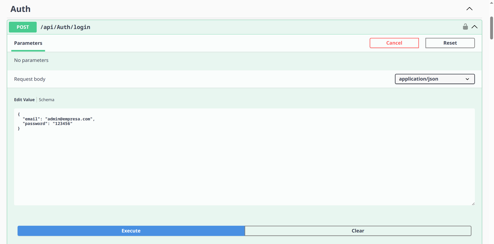
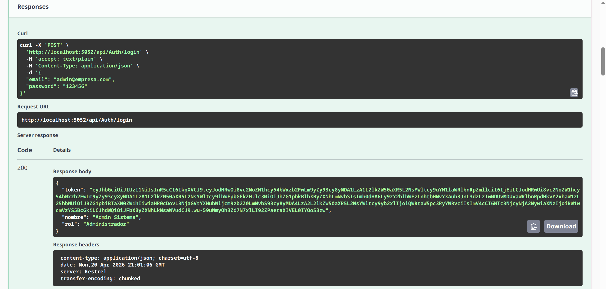

---

### 🔐 Autorización JWT

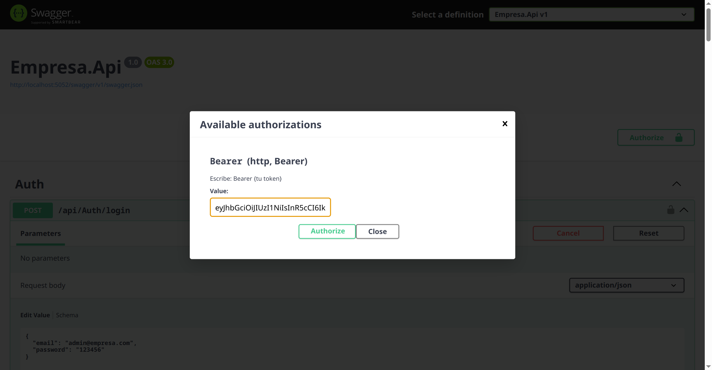
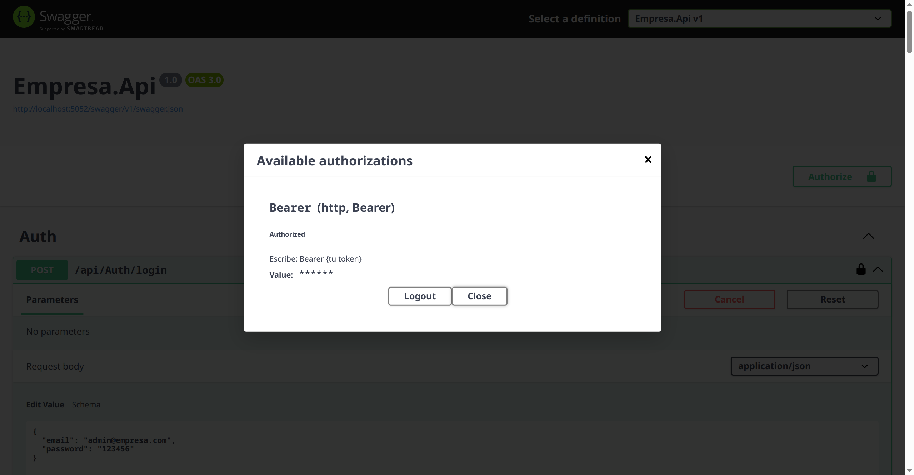

---

### 📦 Productos

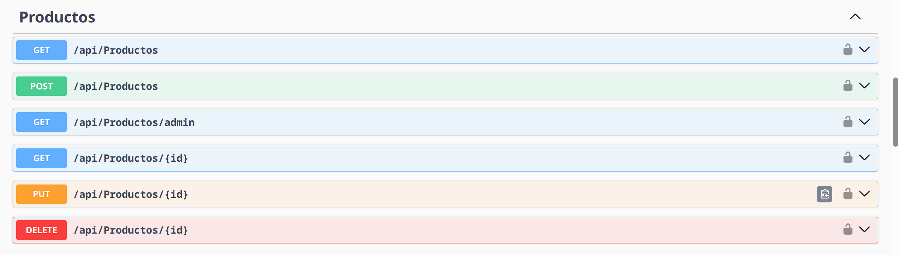
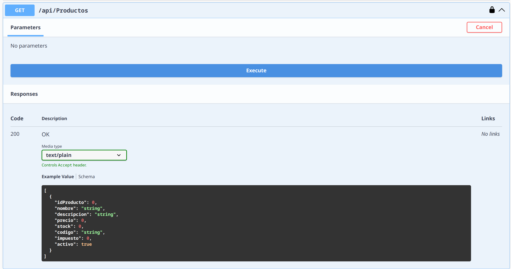
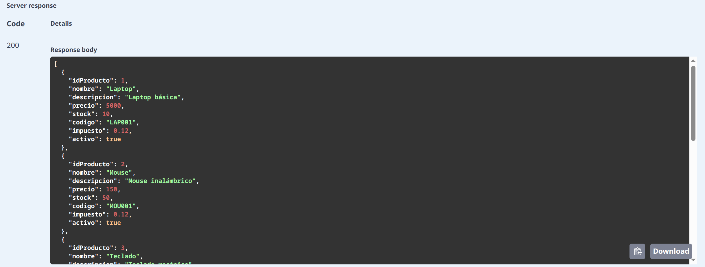

---

### 🧾 Ventas

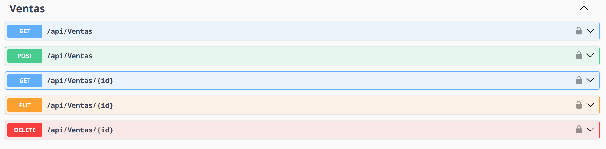
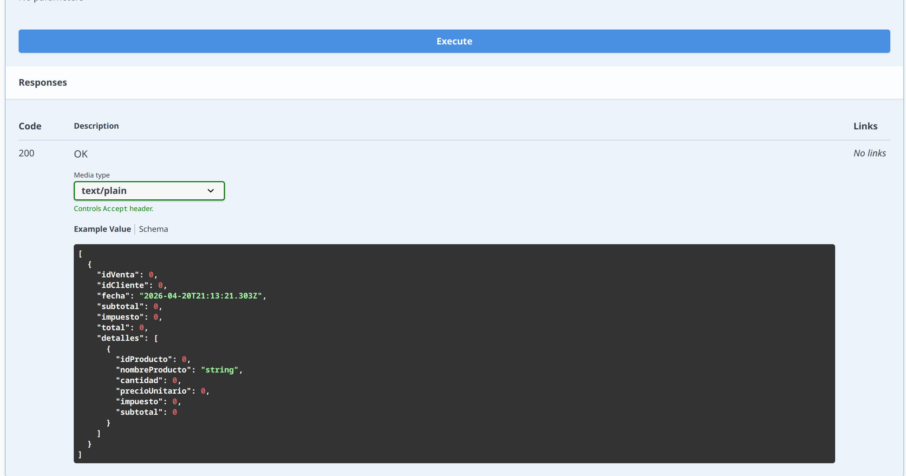
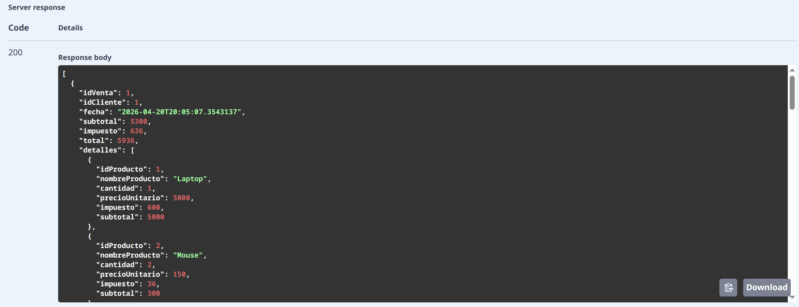

---

### 📘 Swagger

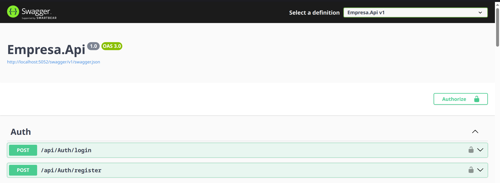

---

## 🧠 Arquitectura

El proyecto sigue una separación por capas:

* Application/
* Domain/
* Infrastructure/
* API/

---

## 🔒 Seguridad

* Contraseñas hasheadas con BCrypt
* Autenticación con JWT
* Control de acceso basado en roles

---

## 🧪 Pruebas de la API

Se recomienda usar:

* Swagger UI
* Postman

---

## 🧠 Nota

Este proyecto utiliza:

* SQL Server para desarrollo local
* PostgreSQL para despliegue en producción

---

## 👨‍💻 Autor

Desarrollado como proyecto de portafolio para demostrar habilidades en desarrollo backend con .NET.
